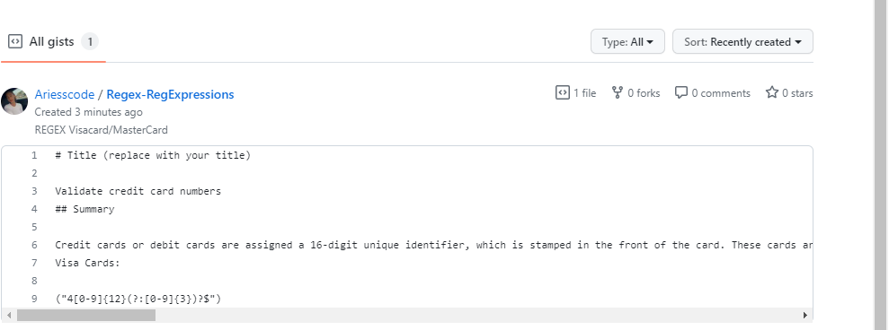

# Computer Science for JavaScript: Regex Tutorial 

No installation needed.

Gist Link: https://gist.github.com/Ariesscode/856e6db6f75b44005e2f04db6b2c2485
GitHub Repo: https://github.com/Ariesscode/REGEX_RegExpressions/commits/main


## What Is a Regex?

REGEX or regular expressions in coding is a series of characters of letters, symbols, or numbers that specify a search pattern in a given string of text. For example validators are used to find a required pattern to confirm accesssibilty. REGEX are commonly used to create logical conditions. REGEX are used in common programming languages such as JavaScript, Perl, and PHP. Below I will add different parts of the regular expression and what their duty or meaning is in the expression. Also, checkout the link provided to see my first GIST post created. I will deconstruct an example of a regular expression and explain what it is doing in my gist template!

GIST allows you to add code snippets and share with others.




## User Story

```md
AS A web development student
I WANT a tutorial explaining a specific regex
SO THAT I can understand the search pattern the regex defines
```

## Acceptance Criteria

```md
GIVEN a regex tutorial
WHEN I open the tutorial
THEN I see a descriptive title and introductory paragraph explaining the purpose of the tutorial, a summary describing the regex featured in the tutorial, a table of contents linking to different sections that break down each component of the regex and explain what it does, and a section about the author with a link to the author’s GitHub profile
WHEN I click on the links in the table of contents
THEN I am taken to the corresponding sections of the tutorial
WHEN I read through each section of the tutorial
THEN I find a detailed explanation of what a specific component of the regex does
WHEN I reach the end of the tutorial
THEN I find a section about the author and a link to the author’s GitHub profile
```


© 2023 edX Boot Camps LLC. Confidential and Proprietary. All Rights Reserved.
